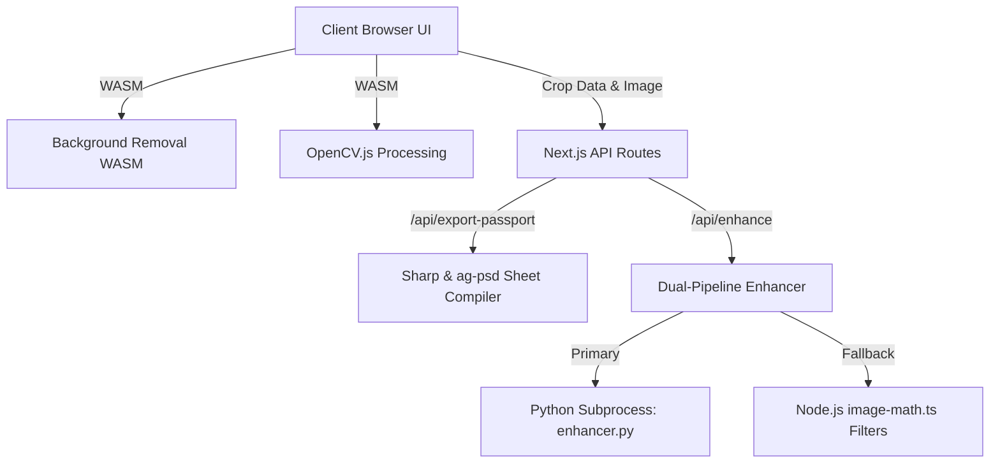

# PixelForge ✦
### **The High-Performance, Zero-API Image Engineering Toolkit**

PixelForge is a state-of-the-art, client-side first image workshop. It leverages highly optimized native machine-learning models, WASM binaries, and local rendering engines to enhance portraits, remove backgrounds, and generate ICAO-compliant passport photo sheets instantly—with **zero API costs or external dependencies**.

---

## ⚡ Features & Modules

### 1. Magic Background Eraser
* **Technology**: `@imgly/background-removal` (WASM)
* **Execution**: 100% Client-side. No images or metadata ever leave the browser.
* **Algorithm**: Accurate semantic segmentation using deep learning models packaged in WebAssembly.
* **UI**: Fluid glassmorphic progress overlays and interactive dropzones.

### 2. Auto-Passport Generator
* **Technology**: `react-easy-crop`, `sharp` (Node.js), and `ag-psd` (PSD compilation)
* **Execution**: Hybrid (client-side cropping & backend compositing)
* **Pipeline**:
  1. Removes portrait background on the fly (via the background removal WASM module).
  2. Guides the user via interactive guidelines to scale and center faces to official **45x35mm** dimensions.
  3. Previews print layouts (e.g. 4x1 grid or 4x6" landscape printing layout).
  4. Backend compiling: A Node.js API endpoint uses `sharp` and `ag-psd` to render a layered, high-resolution **4x6" Landscape PSD print sheet** mapped with 8 distinct photos for studio printing.

### 3. OpenCV.js Web-Enhanced Toolkit
* **Technology**: `OpenCV.js` (WASM)
* **Execution**: Client-side hardware-accelerated processing.
* **Features**:
  * **CLAHE Integration**: High-fidelity Contrast-Limited Adaptive Histogram Equalization applied in the Lab color space to preserve chromatic details.
  * **Vibrance Corrections**: Adjusts saturation dynamic curves in the HSV color space.
  * **Focus/Blur Scoring**: Uses Laplacian variance algorithm to check focus quality and flag blurry portraits.
  * **Interactive Sliders**: Real-time feedback before downloading studio-quality masters.

### 4. Professional Studio Enhancer (Dual Pipeline)
* **Technology**: Python OpenCV/NumPy or native Node.js fallback.
* **Execution**: Server-Side Route (`/api/enhance`)
* **Pipeline**:
  * **Primary (Python Core)**: Uses a background Python process (`lib/enhancer.py`) running:
    1. *Grayscale Detection*: Analyzes channel variance to preserve clean B&W photography.
    2. *Fast Non-Local Means Denoising*: Calibrated filter to remove sensor noise without washing out skin textures.
    3. *Precision Bilateral Smoothing*: Edge-preserving skin smoothing blended 30% with original details.
    4. *LAB CLAHE*: Dynamic range balance (clip limit 1.2) for shadow lift.
    5. *Edge-Masked Unsharp Masking*: Uses a thresholded Laplacian edge mask so sharpening is restricted to eyes, hair, and clothing, ignoring flat skin regions.
    6. *Highlights Temperature Shift*: Applies a slight cool temperature blue-shift (+2) to highlights for a professional studio look.
  * **Fallback (Node.js)**: If Python is unavailable, Next.js falls back to a custom JavaScript pipeline (`lib/image-math.ts` + `sharp`) featuring matching bilateral denoisers, frequency separation, and micro-sharpening filters.

---

## 🛠️ Architecture & Directory Map



Key file architecture:
* [page.tsx](file:///Users/apple/Developer/PixelForge/app/page.tsx): Modern, neobrutalist landing page with Spotlight animations.
* [remove-bg/page.tsx](file:///Users/apple/Developer/PixelForge/app/remove-bg/page.tsx): Client-side background removal workshop.
* [passport/page.tsx](file:///Users/apple/Developer/PixelForge/app/passport/page.tsx): Passport alignment tool utilizing face cropping.
* [enhance/page.tsx](file:///Users/apple/Developer/PixelForge/app/enhance/page.tsx): OpenCV.js web enhancement dashboard.
* [api/enhance/route.ts](file:///Users/apple/Developer/PixelForge/app/api/enhance/route.ts): Studio enhancer route supporting Python subprocess spawning or Node.js fallback.
* [enhancer.py](file:///Users/apple/Developer/PixelForge/lib/enhancer.py): Native Python image processing script.
* [image-math.ts](file:///Users/apple/Developer/PixelForge/lib/image-math.ts): High-performance JS image filters (Lanczos-3, Bilateral, Fast Box Blur).
* [opencv-utils.ts](file:///Users/apple/Developer/PixelForge/lib/opencv-utils.ts): TypeScript wrappers for the WebAssembly OpenCV runtime.

---

## 🚀 Quick Start & Local Setup

### 1. Clone & Install Dependencies
Ensure you have [Node.js 18+](https://nodejs.org/) installed.
```bash
git clone https://github.com/iam-Sourov/PixelForge.git
cd PixelForge
npm install
```

### 2. (Optional) Install Python Dependencies
The server-side premium studio enhancer leverages OpenCV in Python. For the best enhancement results, install:
```bash
pip install opencv-python numpy
```
*Note: If Python or the modules are missing, the server will transparently fall back to the built-in Node.js enhancement pipeline without any interruption.*

### 3. Run Development Server
```bash
npm run dev
```
Open `http://localhost:3000` to start editing.

---

## 🏎️ Production Builds & Diagnostics

### Run Quality Inspections
Before deploying, ensure that code compilation, type safety, and formatting guidelines are met.

* **Linting Code**:
  ```bash
  npm run lint
  ```
* **Typechecking**:
  ```bash
  npm run typecheck
  ```
* **Production Build**:
  ```bash
  npm run build
  ```

### Vercel Serverless Configurations
This project is configured to work out-of-the-box on serverless hosts like Vercel. 
* High-load packages like `@imgly/background-removal` load asset chunks dynamically on the client via `import(...)` declarations, minimizing the critical Bundle size.
* If hosting in serverless environments where spawning processes is restricted, the engine automatically routes image data through the native Node.js WebAssembly-friendly fallback, avoiding crashes.

---

## 🎨 Philosophy & Design System
PixelForge is built around a **Premium Glassmorphic Dark-Mode UI** featuring:
* Floating capsule nav-bars.
* Custom dropzone mechanics (`react-dropzone`).
* Spotlights that trace cursor position.
* Consistent focus borders and responsive layout grids.
* Accurate target outputs (300dpi boundaries, 4x6" canvas scaling).
